# � Azure Marketplace 集�完整指�

## 📋 概述

本文档��MediaGenie �Azure Marketplace 集�的完整�置指�包括 **Landing Page** �**Connection Webhook** 的��和�置�

---

## � Azure Marketplace 必需的端�

### 1. Landing Page URL (必需)
**用�*: 用户�Marketplace 购买�首次访问的页�

**URL**: `https://your-backend.azurewebsites.net/marketplace/landing`

**功能**:
- 欢�新用�
- 显示订阅信�
- 引导用户完�设置
- 激活订�

### 2. Connection Webhook URL (必需)
**用�*: �收 Marketplace 订阅生命周期事件

**URL**: `https://your-backend.azurewebsites.net/marketplace/webhook`

**功能**:
- �收订阅事件 (购买��消��更等)
- 验�请求签�
- 更新订阅状�
- 触�业务逻辑

---

## 🚀 已��的功能

### �Landing Page (`/marketplace/landing`)

#### 功能特�
- ��观的欢�页�
- �显示订阅信� (token, subscription_id)
- �快速开始步骤引�
- �直�链�到应用主页和文档
- ��应�设�移动端��

#### 查询�数
```
GET /marketplace/landing?token=<marketplace-token>&subscription_id=<sub-id>
```

- `token`: Marketplace �供的临时令�
- `subscription_id`: 订阅 ID

#### 示例访问
```bash
# 测试访问
curl https://your-backend.azurewebsites.net/marketplace/landing

# 带�数访�
curl "https://your-backend.azurewebsites.net/marketplace/landing?token=abc123&subscription_id=sub-001"
```

---

### �Connection Webhook (`/marketplace/webhook`)

#### 支�的事件类�
- `Subscribe` - 新订阅创�
- `Unsubscribe` - 订阅�消
- `ChangePlan` - 更改订阅计划
- `ChangeQuantity` - 更改订阅数�
- `Suspend` - 暂�订阅
- `Reinstate` - ��订阅

#### 请求格�
```json
{
  "action": "Subscribe",
  "subscriptionId": "sub-123",
  "planId": "basic",
  "quantity": 1,
  "customerId": "customer-456",
  "customerEmail": "user@example.com",
  "timestamp": "2025-10-22T10:00:00Z"
}
```

#### �应格�
```json
{
  "status": "success",
  "message": "Event Subscribe processed successfully",
  "subscription_id": "sub-123"
}
```

#### 测试 Webhook
```bash
# 测试订阅事件
curl -X POST https://your-backend.azurewebsites.net/marketplace/webhook \
  -H "Content-Type: application/json" \
  -d '{
    "action": "Subscribe",
    "subscriptionId": "test-sub-001",
    "planId": "basic",
    "quantity": 1,
    "customerId": "test-customer",
    "customerEmail": "test@example.com"
  }'
```

---

## 📊 管�端点

### 查看所有订�
```bash
GET /marketplace/subscriptions

# 示例
curl https://your-backend.azurewebsites.net/marketplace/subscriptions
```

### 查看特定订阅
```bash
GET /marketplace/subscriptions/{subscription_id}

# 示例
curl https://your-backend.azurewebsites.net/marketplace/subscriptions/sub-123
```

### 查看事件日志
```bash
GET /marketplace/events?limit=50

# 示例
curl https://your-backend.azurewebsites.net/marketplace/events
```

### �康检�
```bash
GET /marketplace/health

# 示例
curl https://your-backend.azurewebsites.net/marketplace/health
```

---

## 🔧 �Partner Center 中��

### 步骤 1: 登录 Partner Center

1. 访问: https://partner.microsoft.com/dashboard
2. 选择 **Marketplace offers**
3. 找到你的 MediaGenie offer

### 步骤 2: �置技术��

导航� **Offer setup** �**Technical configuration**

#### Landing Page URL
```
https://mediagenie-api-xxxxxx.azurewebsites.net/marketplace/landing
```

**说�**: 替� `mediagenie-api-xxxxxx` 为你的�际��Web App �称�

#### Connection Webhook
```
https://mediagenie-api-xxxxxx.azurewebsites.net/marketplace/webhook
```

#### Azure Active Directory Tenant ID
```
你的 Azure AD Tenant ID (�Azure Portal ��)
```

#### Azure Active Directory Application ID
```
你的应用注册 ID (�Azure AD ��)
```

### 步骤 3: �置 Webhook 密钥 (生产必需)

1. �Partner Center 生�共享密钥
2. 将密钥存储到 Azure Key Vault
3. �置�境��:
   ```bash
   MARKETPLACE_WEBHOOK_SECRET=your-shared-secret
   ```

---

## � 安全性��

### Webhook 签�验� (生产必需)

#### 1. ��共享密钥

�Partner Center �Technical Configuration �Connection Webhook 中生��

#### 2. 存储�Key Vault

```bash
az keyvault secret set \
  --vault-name your-keyvault \
  --name MarketplaceWebhookSecret \
  --value "your-shared-secret"
```

#### 3. �置 Web App

```bash
az webapp config appsettings set \
  --name mediagenie-api-xxxxxx \
  --resource-group MediaGenie-Marketplace-RG \
  --settings \
    MARKETPLACE_WEBHOOK_SECRET="@Microsoft.KeyVault(SecretUri=https://your-kv.vault.azure.net/secrets/MarketplaceWebhookSecret/)"
```

#### 4. �用签�验�

�`marketplace.py` 中��`verify_signature()` 函数:

```python
def verify_signature(body: bytes, signature: str) -> bool:
    shared_secret = os.getenv("MARKETPLACE_WEBHOOK_SECRET")
    expected_signature = hmac.new(
        shared_secret.encode(),
        body,
        hashlib.sha256
    ).hexdigest()
    return hmac.compare_digest(signature, expected_signature)
```

---

## � 订阅生命周期�程

### 1. 新订�(Subscribe)

```mermaid
sequenceDiagram
    用户->>Marketplace: 购买 MediaGenie
    Marketplace->>Webhook: POST /webhook (Subscribe)
    Webhook->>Database: 创建订阅记录
    Webhook->>Marketplace: 返� 200 OK
    Marketplace->>�览� �定�到 Landing Page
    �览�>>Landing Page: GET /landing?token=xxx
    Landing Page->>用户: 显示欢�页�
    用户->>应用: 点击 "开始使�
    应用->>用户: 开始使用��
```

### 2. �消订阅 (Unsubscribe)

```mermaid
sequenceDiagram
    用户->>Marketplace: �消订阅
    Marketplace->>Webhook: POST /webhook (Unsubscribe)
    Webhook->>Database: 更新订阅状�
    Webhook->>Application: �用用户访问
    Webhook->>Marketplace: 返� 200 OK
```



---

## 🧪 测试指�

### 本地测试

#### 1. �动�务
```bash
cd backend/media-service
python main.py
```

#### 2. 测试 Landing Page
```bash
# �览器访�
http://localhost:8000/marketplace/landing?token=test123&subscription_id=sub-test
```

#### 3. 测试 Webhook
```bash
curl -X POST http://localhost:8000/marketplace/webhook \
  -H "Content-Type: application/json" \
  -d '{
    "action": "Subscribe",
    "subscriptionId": "local-test-001",
    "planId": "basic",
    "quantity": 1,
    "customerId": "test-customer"
  }'
```

### 生产测试

#### 1. 使用 Partner Center 测试工具

Partner Center �Technical Configuration �**Test publish**

#### 2. 手动测试

```bash
# Landing Page
curl "https://your-backend.azurewebsites.net/marketplace/landing?token=test&subscription_id=test"

# Webhook
curl -X POST https://your-backend.azurewebsites.net/marketplace/webhook \
  -H "Content-Type: application/json" \
  -d '{"action":"Subscribe","subscriptionId":"prod-test-001","planId":"basic","quantity":1}'
```

#### 3. 查看日志

```bash
az webapp log tail \
  --name mediagenie-api-xxxxxx \
  --resource-group MediaGenie-Marketplace-RG
```

---

## 📊 监�和日�

### 查看订阅统计

```bash
curl https://your-backend.azurewebsites.net/marketplace/subscriptions
```

**�应示例**:
```json
{
  "total": 5,
  "subscriptions": [
    {
      "subscription_id": "sub-001",
      "plan_id": "basic",
      "quantity": 1,
      "customer_id": "customer-123",
      "status": "Subscribed",
      "created_at": "2025-10-22T10:00:00Z"
    }
  ]
}
```

### 查看事件日志

```bash
curl https://your-backend.azurewebsites.net/marketplace/events?limit=20
```

**�应示例**:
```json
{
  "total": 15,
  "events": [
    {
      "event": "webhook_received",
      "event_type": "Subscribe",
      "subscription_id": "sub-001",
      "timestamp": "2025-10-22T10:00:00Z"
    }
  ]
}
```

---

## 🔄 Webhook �试策略

Azure Marketplace 会在以下情况�试 Webhook:

- HTTP 5xx 错误
- 网络超时
- 无��

**�试间隔**: 
1. 立�
2. 1分钟�
3. 5分钟�
4. 15分钟�
5. 1�时�

**建议**: 确� Webhook 处��*幂等�*(多次执行相�结�)�

---

## 🛠�故障�查

### 问题 1: Landing Page 无法访问

**症状**: 404 错误

**解决方案**:
```bash
# 检查路由是�注�
curl https://your-backend.azurewebsites.net/marketplace/health

# 查看日志
az webapp log tail -n mediagenie-api-xxxxxx -g MediaGenie-Marketplace-RG
```

### 问题 2: Webhook 未收到事�

**症状**: Marketplace 报告 Webhook 失败

**解决方案**:
```bash
# 1. 验� URL �访�
curl -X POST https://your-backend.azurewebsites.net/marketplace/webhook \
  -H "Content-Type: application/json" \
  -d '{"action":"Subscribe","subscriptionId":"test"}'

# 2. 检查防�墙规则
az webapp config access-restriction show \
  -n mediagenie-api-xxxxxx \
  -g MediaGenie-Marketplace-RG

# 3. 检�HTTPS �书
openssl s_client -connect your-backend.azurewebsites.net:443
```

### 问题 3: 签�验�失败

**症状**: Webhook 返� 401 Unauthorized

**解决方案**:
```bash
# 检查密钥是�正确��
az webapp config appsettings list \
  -n mediagenie-api-xxxxxx \
  -g MediaGenie-Marketplace-RG \
  --query "[?name=='MARKETPLACE_WEBHOOK_SECRET']"

# �新生�和�置密�
# 1. Partner Center ��新生�
# 2. æ›´æ–° Key Vault
# 3. �� Web App
```

---

## ��布�检查清�

### Partner Center �置
- [ ] Landing Page URL 已��
- [ ] Connection Webhook URL 已��
- [ ] Azure AD Tenant ID 已填�
- [ ] Azure AD Application ID 已注�
- [ ] Webhook 共享密钥已生�

### 端点测试
- [ ] Landing Page �访�(200 OK)
- [ ] Webhook �� POST 请求
- [ ] 签�验�正常工作
- [ ] 所有事件类�正确处�
- [ ] HTTPS �书有效

### 安全�
- [ ] Webhook 密钥存储�Key Vault
- [ ] �用签�验�
- [ ] HTTPS Only 已��
- [ ] CORS 正确�置

### 监�
- [ ] 日志记录正常
- [ ] �康检查端点��
- [ ] 订阅管�端点�访�

---

## 📚 相关文档

- [Azure Marketplace Documentation](https://docs.microsoft.com/azure/marketplace/)
- [SaaS Fulfillment APIs](https://docs.microsoft.com/azure/marketplace/partner-center-portal/pc-saas-fulfillment-api-v2)
- [Webhook Best Practices](https://docs.microsoft.com/azure/marketplace/partner-center-portal/pc-saas-fulfillment-webhook)

---

## 🆘 ��帮助

### 技术支�
- Partner Center 支�: https://partner.microsoft.com/support
- Azure 支�: https://azure.microsoft.com/support/

### 有用的命�

```bash
# 查看�端日志
az webapp log tail -n mediagenie-api-xxxxxx -g MediaGenie-Marketplace-RG

# ���端
az webapp restart -n mediagenie-api-xxxxxx -g MediaGenie-Marketplace-RG

# 测试 Landing Page
curl "https://mediagenie-api-xxxxxx.azurewebsites.net/marketplace/landing"

# 测试 Webhook
curl -X POST https://mediagenie-api-xxxxxx.azurewebsites.net/marketplace/webhook \
  -H "Content-Type: application/json" \
  -d '{"action":"Subscribe","subscriptionId":"test-001","planId":"basic","quantity":1}'

# 查看订阅
curl https://mediagenie-api-xxxxxx.azurewebsites.net/marketplace/subscriptions

# 查看事件日志
curl https://mediagenie-api-xxxxxx.azurewebsites.net/marketplace/events
```

---

## � 总结

你的 MediaGenie 应用�在包�完整�Azure Marketplace 集�:

�**Landing Page** - 欢�新用户并引导设置  
�**Connection Webhook** - �收并处�订阅事� 
�**订阅管�** - 查看和管�所有订� 
�**事件日志** - 审计所�Marketplace 事件  
�**安全�* - 支�签�验��Key Vault  

**�在�以�Partner Center 中�置这些端点并�布�Azure Marketplace! 🚀**
